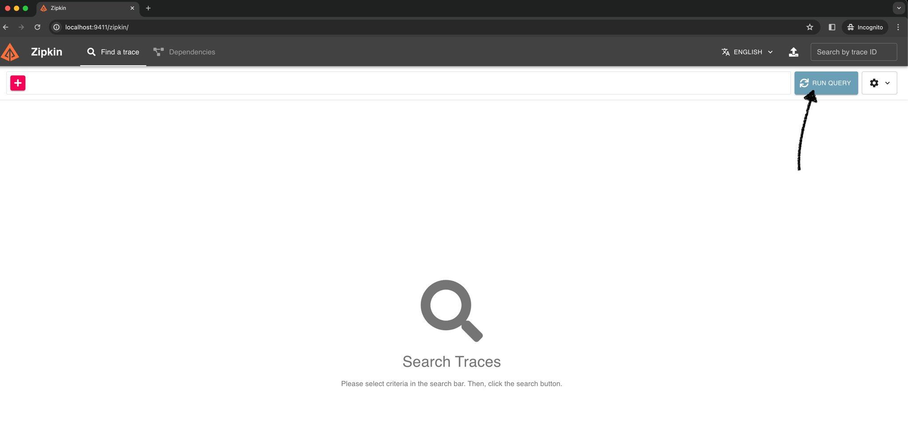
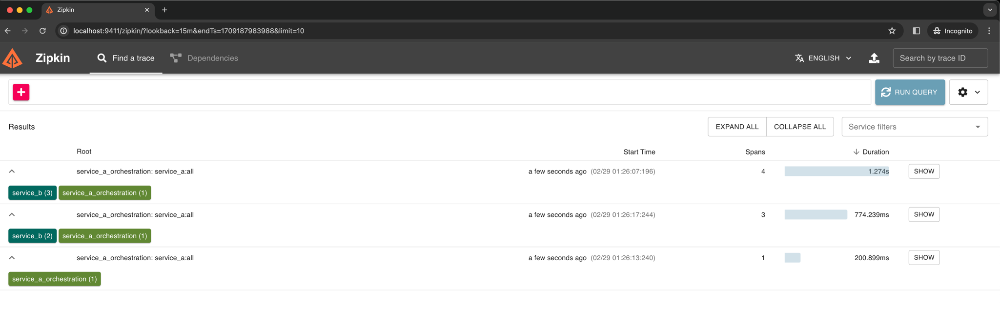
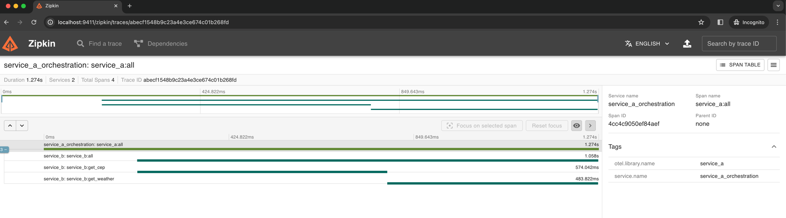

# fullcycle-distr-trace-span

Distributed Trace &amp; Span

# ⚠️ Create your API key from weather API

- You need to **create your own API key** by accessing this URL [🌦️weather API](https://www.weatherapi.com/signup.aspx)
- After that, you can use your api_key, and you can put this into the json config below.
- You can use this API key `3a8c1f1cf26f457394342515242702` if you do not have one, but we do not guarantee if that key
  is valid at the moment you run the project, so we highly recommend you create your own API key.

# ⚙️ Setting up

- Execute the command: `make prepare`.
- We have this JSON example, you must change the `temperature.api_key` with your weather API key credentials in the
  file: `env.json`.
```json
{
  "service_a": {
    "port": "8085"
  },
  "service_b": {
    "port": "50055",
    "host": "service_b:50055"
  },
  "temperature" : {
    "url": "https://api.weatherapi.com",
    "api_key": "3a8c1f1cf26f457394342515242702"
  },
  "cep": {
    "url": "https://viacep.com.br"
  },
  "zipkin": {
    "host": "zipkin_svc:9411",
    "endpoint": "http://zipkin_svc:9411/api/v2/spans"
  }
}
```
- Finally, you can run the command `make run`.

# 🧪 Testing in Local

- After you **start** the application, you can test it.
- We are using the `:8080` port.
- We have this endpoint: `/temperature` in `POST` method to get the temperature by CEP, you can use it in localhost:
  - ✅ `200 response`
    ```shell
    curl -i -X POST http://127.0.0.1:8080/temperature -d '{"cep":"64075525"}'
    ```
    ```text
    HTTP/1.1 200 OK
    Content-Type: application/json
    Date: Wed, 28 Feb 2024 04:27:39 GMT
    Content-Length: 56
    
    {"city":"Teresina","temp_C":25,"temp_F":77,"temp_K":298}
    ```
  - ❌ `422 response`
    ```shell
    curl -i -X POST http://127.0.0.1:8080/temperature -d '{"cep":"012345"}'
    ```
    ```text
    HTTP/1.1 422 Unprocessable Entity
    Content-Type: text/plain; charset=utf-8
    X-Content-Type-Options: nosniff
    Date: Wed, 28 Feb 2024 04:29:17 GMT
    Content-Length: 16
    
    invalid zipcode
    ```
  - ❌ `404 response`
    ```shell
    curl -i -X POST http://127.0.0.1:8080/temperature -d '{"cep":"00001033"}'
    ```
    ```text
    HTTP/1.1 404 Not Found
    Content-Type: text/plain; charset=utf-8
    X-Content-Type-Options: nosniff
    Date: Wed, 28 Feb 2024 04:31:00 GMT
    Content-Length: 22
    
    can not found zipcode
    ```

# 🤖 Access to Zipkin
- You can access to this URL: `http://localhost:9411/`
- You need to click the refresh button (RUN QUERY):

- So you can see the results:


